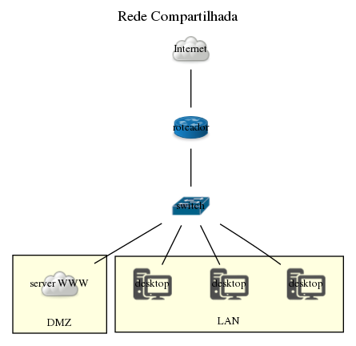

## Entregas
- Diagrama de Classes UML (arquivo .png) na raiz do projeto e referenciado dentro do arquivo Solucao.md:
  **Foi realizado o digrama de classes utilizando herança;**
- Aplicativo com interface que permita a interação com o usuário:
   Menu está conforme as especificações
  - Criar os dispositivos
  - Criar subgrafo/fazer conexão
  - Visualizar o diagrama
  - Exportar o diagrama no formato de acordo com a DOT Language
  - Persistir em disco o diagrama em um formato próprio implementado como .incompleto
  - Carregar em memória um diagrama a partir de um arquivo em disco a partir do diagrama salvo em .incompleto
- Alguns testes de unidade para comprovar que as restrições de associações entre elementos funcionam
- Verificação ao tentar exportar em .dot se todas os dispositivos tem suas conexões
- .gitignore criado adequadamente 
- build.gradle adaptado para gerar um JAR executável
- Compilação com o gradle garantida

## Diagrama gerado com o Programa
 

## Diagrama Uml

