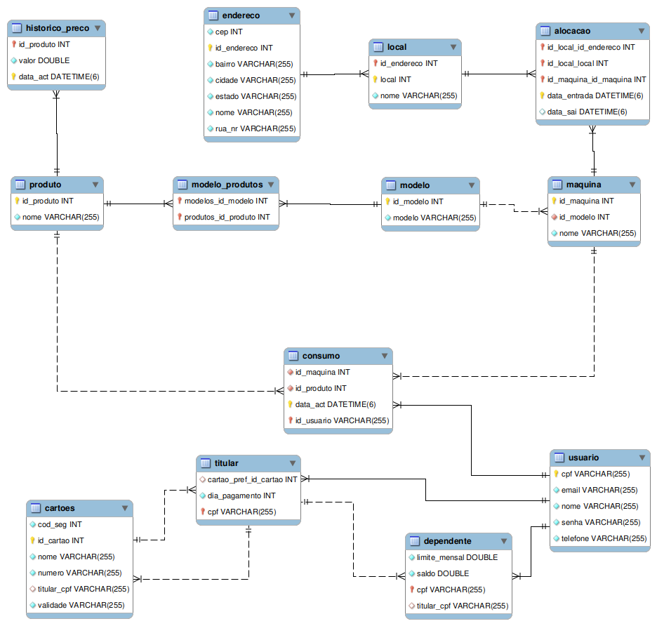

# Projeto Final de Banco de dados

O presente projeto tem como objetivo a criação de um sistema a ser utilizado em máquinas automáticas de café da Startup CaféOni em locais com grande fluxo de pessoas, como instituições de ensino, empresas, shopping, academias, condomínios etc.

## Necessidades do Cliente
* Diferentes modelos de máquina, sendo que a diferença entre
os modelos está na variedade de tipos de café que ela opera;

* O preço do café é dinâmico;

* As máquinas de café podem ser movidas de locais.Assim, para cada máquina de café é necessário registrar seu histórico de alocações. Saber o período exato que uma máquina esteve em um local. O local deve ter um nome (i.e. IFSC), endereço completo (rua, bairro, cidade, estado, CEP) e complemento dentro do local (i.e. sala de
professores, hall de entrada, refeitório);

* No cadastro é necessário fornecer o nome, senha, email, cpf, número de telefone, cartões de crédito (indicar qual cartão será o preferencial) e o dia do mês que será gerada a cobrança. Contudo, só poderá usar a solução se houver uma forma de pagamento cadastrada;

* É possível ainda associar contas dependentes à conta titular, onde os dependentes precisarão instalar o aplicativo e também possuir uma conta de usuário no sistema
(se indicar que é dependente, então não precisará ter cartão de crédito cadastrado). Para cada conta de dependente é necessário informar um nome, um email e um limite mensal, em Reais, que esse dependente poderá para usar;

* Cada usuário precisa se autenticar em cada máquina de café antes que possa fazer uma compra, assim a máquina terá certeza quem está solicitando o café. Se for uma conta dependente, a máquina só irá produzir o café se o limite da conta do usuário ainda não foi atingido;

* O titular pode aumentar o limite de seu dependente a qualquer momento.

## Retorno do Sistema

* O usuário com conta titular poderá acompanhar, a qualquer momento, seu histórico de consumo e de seus dependentes.

* O histórico de consumo deve apresentar: o nome da pessoa que fez o consumo; identificador único da máquina (i.e. um nome curto e amigável) onde o café foi tirado; o local onde a máquina estava no momento que o café foi tirado (i.e. IFSC); qual o tipo do café que foi tirado (i.e. espresso pequeno); qual o valor do café e a data e instante do consumo;

* No final de cada mês o usuário poderá obter uma fatura contendo todas informações apresentadas anteriormente, além do total da fatura daquele mês;

* Dados estatíticos poderam ser emitidos pelo titular como:
    * Total de cafés consumidos em um determinado mês, agrupados por tipo e por usuário;
    * Total de cafés consumidos em um determinado mês, agrupados por dia;
    * Total de cafés consumidos em um determinado mês, agrupados por local de consumo;
    * Valor total das últimas N faturas.


## Modelagem do Banco de dados

Foi utilizado a ferramenta MysqlWorkbench para a confecção do diagrama Entidade Relacionamento.  A seguir o diagrama:

Diagrama feito no Workbench do Banco de dados do Sistema


## Usando o Programa

Para utilizar o programa você precisará baixar o projeto para isto existem duas opções: pelo terminal clonando o repositório ou baixando via zip;

- Pelo terminal basta executar o seguinte comando no terminal:
```sh
https://github.com/BCD29008-classroom/2023-01-projeto-pratico-alanamandim.git
cd
2023-01-projeto-pratico-alanamandim.git/projfinal/
```
- Para baixar via zip, basta ir em <>Code em seguida Dowload ZIP. Assim que tiver terminado o dowload extraia o arquivo e entre na pasta projfinal.

Para rodar a aplicação é recomendado o uso do IntelliJ IDEA Ultimate Edition ou Visual Studio Code;

Antes de rodar aplicação é necessário realizar algumas configurações para se conectar ao banco de dados.
-  Abra a pasta projfinal -> src-> main -> resouerces e finalmente application.properties.
- A conexão do banco ja está configurada e você poderá utiliza-la, basta deixar o arquivo da forma que está, porém caso deseje utilizar um container docker, é necessário que seja feito as alteração:

Quando subimos um container, configuramos o login e a senha e o nome do banco por exemplo:
```code
docker run --rm -p 3306:3306 -v $PWD/mysql_data:/var/lib/mysql -e MYSQL_ROOT_PASSWORD=senhaRoot -e MYSQL_DATABASE=bcd -e MYSQL_USER=aluno -e MYSQL_PASSWORD=aluno --name outrosql mysql/mysql-server:latest 

```
Nesse caso temos o login e senha sendo aluno e o nome do banco outrosql

Para configurar o arquivo application.properties basta:
```propreties
spring.datasource.url=jdbc:mysql://localhost:3306/bcd
spring.datasource.username=aluno
spring.datasource.password=aluno
spring.datasource.driver-class-name=com.mysql.cj.jdbc.Driver

spring.jpa.hibernate.ddl-auto= update
```
Essa ultima linha você define o status do banco, para o primeiro acesso, no caso do banco estar vazio, ou seja, não tem tabelas criadas utilize o CREATE, nos próximos acesso modifique para UPDATE;

## Executando a aplicação
Para executar a aplicação pelo terminal ou pelo VS Code, basta se certificar de estar na pasta projfinal em seguida de o seguinte comando:
```comando
./gradlew bootRun
```

Já para rodar no IntelliJ IDEA basta dar um play ( RUN ProjetoFinalAplication);

Caso este seja seu primeiro acesso, é necessário povoar o banco para isto está disponível o arquivo dml.sql, basta executa-lo. Com isso, o seu banco estará povoado;

## Exemplo de Utilização

### Criando usuário:

```sh
curl --request POST \
  --url http://localhost:8080/adicionaUsuario \
  --header 'Content-Type: application/json' \
  --data '{
	"idUsuario" :  "106.111.222-33",
	"nome": "Tedy Brener",
	"senha": "TD12345",
	"email": "tedy@gmail.com",
	"telefone": "48 98888-8334",
	"nomeCar": "Tedy B",
	"validade": "03/28",
	"numCartao": "2020 3434 2345 3456",
	"codSeg": 346,
	"datapagamento": 10 
}
'
```
Será obtido o seguinte resultado: "Usuario adicionado com sucesso"
### Associando Dependente ao usuario
```sh
curl --request POST \
  --url http://localhost:8080/adicionaDependente \
  --header 'Content-Type: application/json' \
  --data '{
	"idUsuario" :  "088.333.222-11",
	"idTitular" : "106.111.222-33",
	"nome": "Tedy Brener",
	"senha": "TD12345",
	"email": "tedy@gmail.com",
	"telefone": "48 98888-8334",
	"limite": 130,
	"saldo": 130
	
}
'
```
Será obtido o seguinte resultado: "Dependente adicionado com sucesso"
### Adicionando um consumo
```sh
curl --request POST \
  --url http://localhost:8080/adicionaConsumo \
  --header 'Content-Type: application/json' \
  --data '{
	"idUsuario" :  "088.333.222-11",
	"idProduto": 4,
	"idMaquina": 3
}'
```
Será obtido o seguinte resultado: "Consumo cadastrado"

### Tempo de alocação
```sh
curl --request GET \
  --url http://localhost:8080/tempodealocacao \
  --header 'Content-Type: application/json' \
  --data '{
	"idMaquina": 1,
	"idLocal":  1,
	"idEndereco": 1
	
}'
```
Resultado esperado: "[
	[
		"SUS",
		"Dias alocada:",
		5
	]
]"

### Movimentar maquina
```sh
curl --request POST \
  --url http://localhost:8080/movimentaMaquina \
  --header 'Content-Type: application/json' \
  --data '{
	"idMaquina": 3,
	"idLocal" :  2,
	"idEndereco": 3
	
}'
```
Resultado esperado: "Maquina realocada"

### Historico de consumo
```sh
curl --request GET \
  --url 'http://localhost:8080/historicoConsumo?usuario=106.035.852-83'
```
Resultado esperado: "[
	[
		"Usuario",
		"Joana",
		"Maquina",
		"SUS",
		"Local",
		"IFSC-SJ",
		"Tipo de Café",
		"Café Expresso Médio",
		"Valor",
		1.5,
		"Data de consumo",
		"2023-06-20T03:11:52.000+00:00"
	],
	[
		"Usuario",
		"Joana",
		"Maquina",
		"Cariocao",
		"Local",
		"IFSC-FL",
		"Tipo de Café",
		"Café Expresso Grande",
		"Valor",
		2.5,
		"Data de consumo",
		"2023-06-16T03:11:52.000+00:00"
	],
	[
		"Usuario",
		"Joana",
		"Maquina",
		"Serie B",
		"Local",
		"UDESC",
		"Tipo de Café",
		"Mocha Pequeno",
		"Valor",
		2.0,
		"Data de consumo",
		"2023-06-17T03:11:52.000+00:00"
	],
	[
		"Usuario",
		"Joana",
		"Maquina",
		"Jurerê",
		"Local",
		"IFSC-SJ",
		"Tipo de Café",
		"Café com Leite Médio",
		"Valor",
		2.5,
		"Data de consumo",
		"2023-06-19T03:11:52.000+00:00"
	]
]

### Consumo Total de um Usuario por mês informado
```sh
curl --request GET \
  --url http://localhost:8080/valorTotalMes \
  --header 'Content-Type: application/json' \
  --data '{
	"idUsuario" :  "106.035.852-83",
	"mes": 6
}'
```
 Resultado Esperado: " [
	[
		"Valor",
		8.5
	]
]"

### Total de N faturas de um usuario
```sh
curl --request GET \
  --url http://localhost:8080/valorTotalNFaturas \
  --header 'Content-Type: application/json' \
  --data '{
	"quantidade": 2,
	"idUsuario" :  "106.035.852-83"
	
}'
```
 Resultado Esperado: " [
	[
		"Valor",
		8.5
	]
]"

### Modifica Limite do Dependente
```sh
curl --request PUT \
  --url http://localhost:8080/modificaLimite \
  --header 'Content-Type: application/json' \
  --data '{
	"limite": 250,
	"idDependente": "106.123.456-78",
	"idTitular" :  "106.035.852-83"
}'
```
Resultado Esperado: "Limite alterado para : 250.0"

### Modifica saldo ( caso o titular só queira que seja alterado naquele mês o limite)
```sh
curl --request PUT \
  --url http://localhost:8080/aumentaSaldo \
  --header 'Content-Type: application/json' \
  --data '{
	"limite": 47,
	"idDependente": "106.123.456-78",
	"idTitular" :  "106.035.852-83"
}'
```
Resultado Esperado: "Limite alterado para : 47.0"

### Quantidade de Café consumido no mês agrupado por dia de um usuário
```sh
curl --request GET \
  --url http://localhost:8080/contadorCafeMesAgrupDia \
  --header 'Content-Type: application/json' \
  --data '{
	"idUsuario" :  "106.035.852-83",
	"mes": 6
}'
```

Resultado esperado: "[
	[
		"Dia: ",
		16,
		"Total caafe:",
		1
	],
	[
		"Dia: ",
		17,
		"Total caafe:",
		1
	],
	[
		"Dia: ",
		19,
		"Total caafe:",
		1
	],
	[
		"Dia: ",
		20,
		"Total caafe:",
		1
	]
]"

### Quantidade de café consumida no mês agrupada por local pelo usuário
```sh
curl --request GET \
  --url http://localhost:8080/contadorUsuarioCafeMesAgrupLocal \
  --header 'Content-Type: application/json' \
  --data '{
	"idUsuario" :  "106.035.852-83",
	"mes": 6
}'
```
Resultado Esperado: "[
	[
		"IFSC-SJ",
		2
	],
	[
		"UDESC",
		2
	],
	[
		"IFSC-FL",
		1
	]
]"

### Quantidade de café consumido no mês agrupado por tipo de café pelo usuario
```sh
curl --request GET \
  --url http://localhost:8080/contadorUsuarioMesAgrupCafe \
  --header 'Content-Type: application/json' \
  --data '{
	"idUsuario" :  "106.035.852-83",
	"mes": 6
}'
```
Resultado Esperado: "[
	[
		"Café Expresso Grande",
		"Joana",
		1
	],
	[
		"Mocha Pequeno",
		"Joana",
		1
	],
	[
		"Café com Leite Médio",
		"Joana",
		1
	],
	[
		"Café Expresso Médio",
		"Joana",
		1
	]
]"


