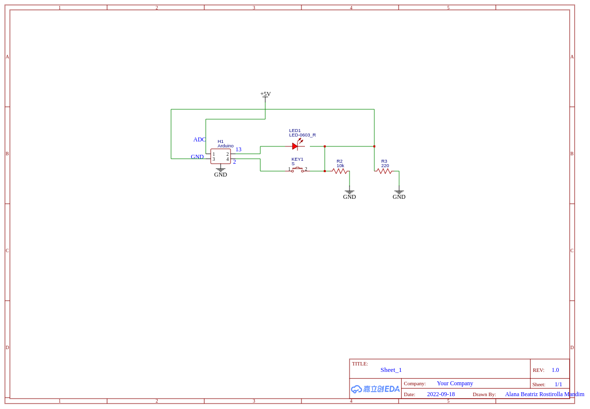
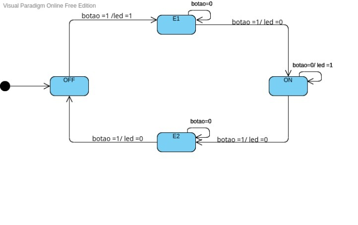

<h1 align="center"> Documentação:   Interruptor LED </h1>

* O presente programa tem como objetivo o funcionamento de uma  lâmpada de Led através do acionamento de um botão.

## Esquema elétrico
Abaixo veremos o esquema elétrico onde, temos o circuito led/botao ligados na placa do arduíno.

 

 Para a montagem deste circuito utilizamos os seguintes pinos do arduíno, 5V, GND, 2 e 13, um resistor de 10k para utilizarmos no circuito do botão, um resistor de 220 para adicionarmos ao circuito do led, um led e um botão. 

 O comportamento do circuito se dará da seguinte forma, conforme é feito o acionamento do botão, o pino 2 recebe o sinal e envia para o pino 13 que irá dar o comando para o led. Vale ressaltar que ambos são pinos digitais.

 ## Máquina de Estado
Para esse programa teremos a seguinte máquina de estado

Para o desenvolvimento deste programa se fez necessário a criação dos estados E1 e E2 devido aos repiques e problemas de acionamento, ele foram criados com o intuito de retirar possíveis problemas de acionamento.