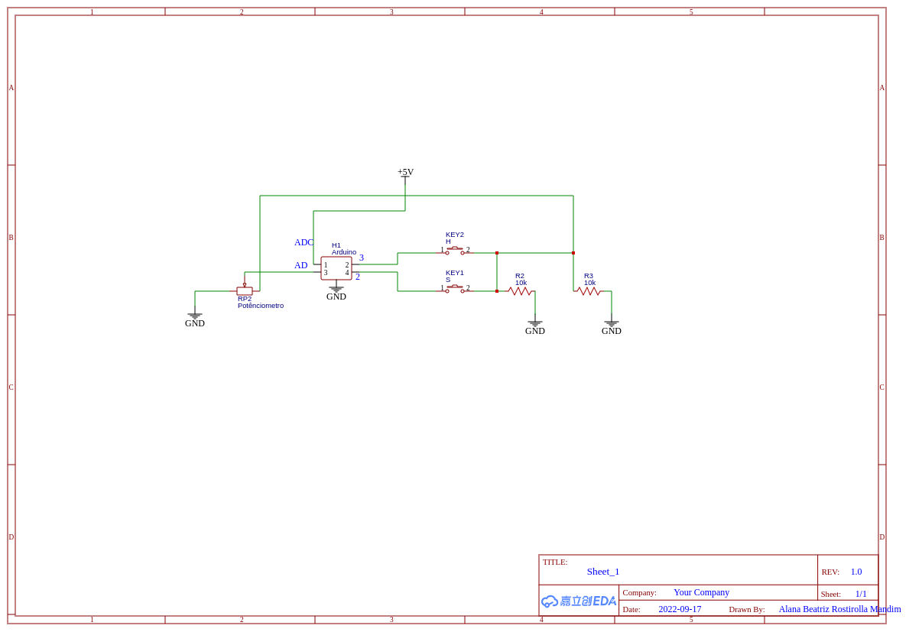
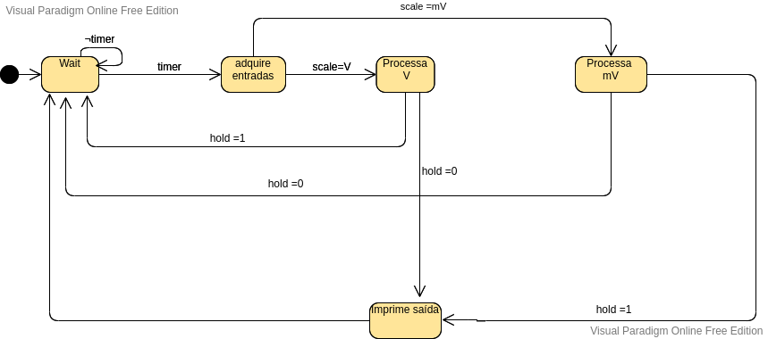

<h1 align="center"> Documentação: Multímetro digital </h1>

O programa tem como objetivo a implementação de um voltímetro digital contendo dois botões, um responsável por alterar a escala do voltimetro em volts(V)  e milivolts(mV), sempre que pressionado ele troca a escala, e um outro botão que tem como objetivo suspender a atualização da saída para que a pessoa possa ter tempo de anotar ou ver com calma o valor q o voltímetro está marcando naquele momento, enquanto o mesmo tiver pressionado, ele não irá alterar o seu valor da tela que no caso será a nossa saída serial. O programa irá fornecer a voltagem presente no potênciometro que estará ligada a uma entrada analógica do arduino.

Entradas: scale (botão - pin 2), hold (botão - pin 3), sinal de tensão (potenciômetro - pin a0).

Saída: Serial (para saída do valor de tensão medido)

A saída serial atualiza o valor de tensão medido no potenciômetro a cada 500ms.

## Circuito Elétrico
Para a implementação deste programa, teremos o seguinte circuito elétrico

## Máquina de Estado
Para implementação do programa, construi-se a seguinte máquina de estado:

O voltimetro começa no estado Wait onde há um timer (500ms) após passado este tempo, ele pega o valor recebido no pino a0 e analisa o botão scale, para saber se tem que ir pro estado processa V ou processa mV, após ir para um dos estados, analisa o botão hold se o mesmo não estiver pressionado, ele vai para o estado imprime saída para que seja informado a voltagem obtida e assim retorna para o estado inicial Wait, caso o hold esteja pressionado, ele vai do estado processa para o estadi Wait sendo assim, não ocorre uma atualização do valor na serial.

