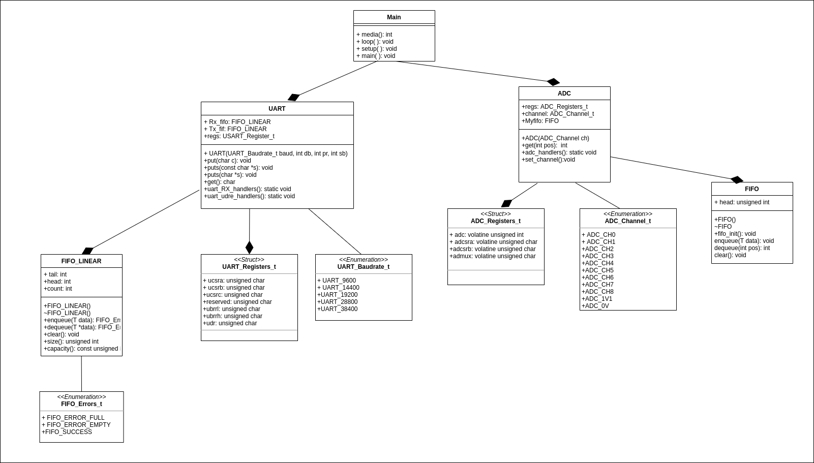

# IFSC STE 2022.2 - Biblioteca para o ATMega328P

Esta é uma biblioteca para uso de componentes do ATMega328P (MCU presente no Arduino Uno) utilizando o GCC. O objetivo deste projeto é estudar e conhecer a MCU AVR em uso e, neste processo, aplicar conceitos de projeto de sistemas embarcados. A linguagem-base da biblioteca é C++, embora alguns trechos de código podem conter sequências C ou em assembly.

## Descrição do Projeto
O presente projeto tem como objetivo  a implementação de um programa capaz de:

-  Adiquirir a cada segundo a leitura analógica de um potênciômetro
-  Armazenar 16 medições mais recentes 
-  Atualizar a média dos valores a cada nova leitura
-  Imprimir via UART, o valor atualizado da média
-  Guardar a entrada de dados do ADC em uma fifo circular
-  Utilizar uma fifo de saída e outra para entrada na UART  

## Sumário
    -FIFO_LINEAR
    -FIFO
    -UART
    -ADC
    
## FIFO_LINEAR
São estruturas de dados do tipo FIFO (first-in first-out), onde o primeiro elemento a ser inserido, será o primeiro a ser retirado, ou seja, adiciona-se itens no fim e remove-se do início.

## FIFO (Circular)
É uma variação da fila linear em que a frente e a traseira são conectadas entre si para otimizar o desperdício de espaço da fila Linear e torná-la eficiente.

## UART
É uma comunicação serial utilizada entre uma placa Arduino e um computador ou outros dispositivos. Como estamos trabalhando com o arduino Uno temos os pinos 0(RX) e 1(TX).

### Inserção de dados puts()
A função put() insere os dados na forma de fila na fifo linear TX

### Retirada dos dados get()
A função get() tem como objetivo desinfileirar os dados armazenados na fifo linear RX de forma que eles sejam excluídos após serem retirados.

### Interrupções
Foram implementadas duas interruoções uart_RX_handlers() que enfileira os dados na fifo linear RX e uart_udre_handlers() que desenfilera os dados da fifo linear TX e guarda no registrador.

## ADC
Para o processamento de sinais analógicos, é utilizado o chamado ADC: conversor analógico-digital. Este é um dos periféricos mais populares encontrados em microcontroladores. O seu trabalho é converter uma tensão aplicada numa entrada do sistema num formato digital.

### Obtenção dos valores
A função get(int pos) tem como objetivo retornar o dado da fila circular correspondente a posição informada.

### Escolha do canal
A função set_channel() tem como objetivo setar o canal no registrador admux, nesse programa foi utilizado o canal 0 que corresponde ao pino A0 do arduíno. Será nesse pino que ligaremos o potênciometro.

### Interrupção
Foi implementado a função adc_handlers que tem como função enfileirar os dados na fifo(circular).

## Material necessário para funcionamento do programa
- Compilador
- Placa Arduino Uno
- Potênciometro
- Placa Protoboard
- Cutecom

## Diagrama UML
