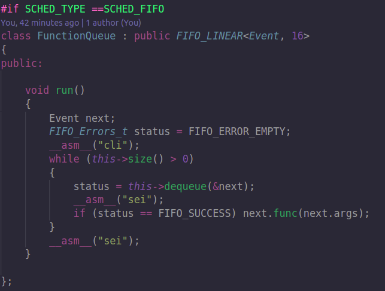
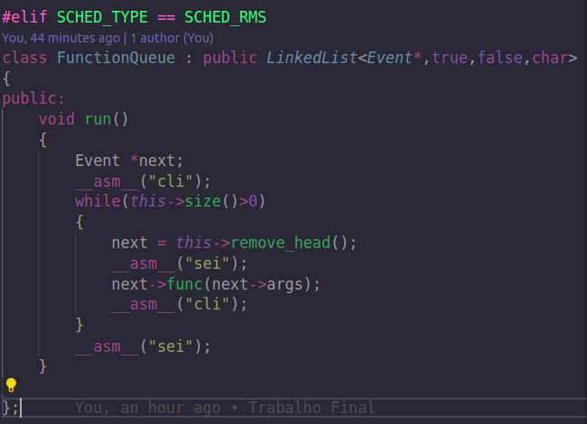
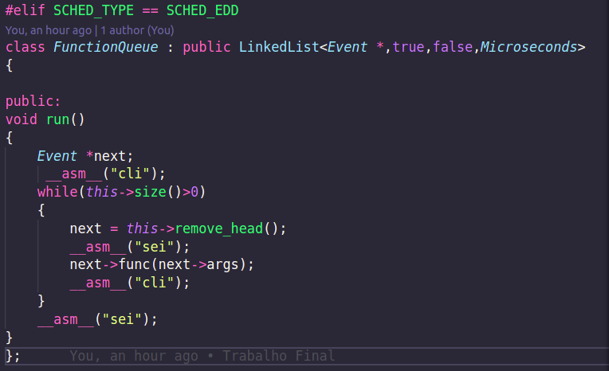

# IFSC STE 2022.2 - Biblioteca 2.0 para o ATMega328P 

Esta é uma biblioteca para uso de componentes do ATMega328P (MCU presente no Arduino Uno) utilizando o GCC. O objetivo deste projeto é estudar e conhecer a MCU AVR em uso e, neste processo, aplicar conceitos de projeto de sistemas embarcados. A linguagem-base da biblioteca é C++, embora alguns trechos de código podem conter sequências C ou em assembly.

## Descrição do Projeto
O presente projeto tem como objetivo  a implementação de um programa capaz de realizar três aplicações diferentes escalonadores:

-  FIFO;
-  Rate Monotonic Scheduling (RMS);
-  Earliest Due Date (EDD).

## Sumário
    -FIFO
    -RMS
    -EDD
    -Componentes
    
    
## FIFO
São estruturas de dados do tipo FIFO (first-in first-out), onde o primeiro evento a ser inserido, será o primeiro a ser retirado, ou seja, adiciona-se itens no fim e remove-se do início.

## RMS
É um escalonador que funciona visando a prioridade,conforme vão sendo inseridos os eventos eles vão sendo "puxados" conforme a sua prioridade. É um bom escalonador porém ineficiente em alguns casos devido ao tempo de execução de cada tarefa, pois caso uma tarefa prioritária tenha um longo tempo de excecução ela pode acabar por passar a frente de uma tarefa menos prioritária porém que tem um deadline menor como consequência acaba por "estourar" o tempo.

## EDD
É um escalonador que funciona visando o tempo de execução das tarefas.

## Componentes
Para implementação dessa biblioteca pegamos a biblioteca anteriormente e adicionamos novas funções

### Function Queue

É um componente do Alarme que guarda a ordem das tarefas agendadas no sistema funcionando como uma FIFO ou uma LinkedList ( nada mais é do que uma fila de tarefas/funções). Possui uma struct de eventos e métodos.

#### Event
Foi criado uma struct Event com atributos visando atender os diferentes escalonadores como por exemplo: visando atender o RMS, foi criadu um char priority pois é atraves desse dado que o escalonador RMS irá ordenar suas funções; release_time utilizado pelo EDD.

#### Métodos

Foram desenvolvidos três métodos um para cada tipo de escalonador.

- FIFO

- RMS

- EDD

### Timer0
O timer0 tem como objetivo ser o "relógio", ou seja contar o tempo em microsegundos e também substui a função delay que tinhamos na blibioteca anterior 

### LinkedList
A linkedlist é uma lista encadeada do tipo ordenada e relativa para um tipo de dado desejado

### Alarme
Esta classe tem como objetivo auxiliar no agendamento e atualização das funções que serão executadas utilizando uma LinkedList e FunctionQueue como atributo.

## Material necessário para funcionamento do programa
- Compilador
- Placa Arduino Uno
- Potênciometro
- Placa Protoboard
- Cutecom

